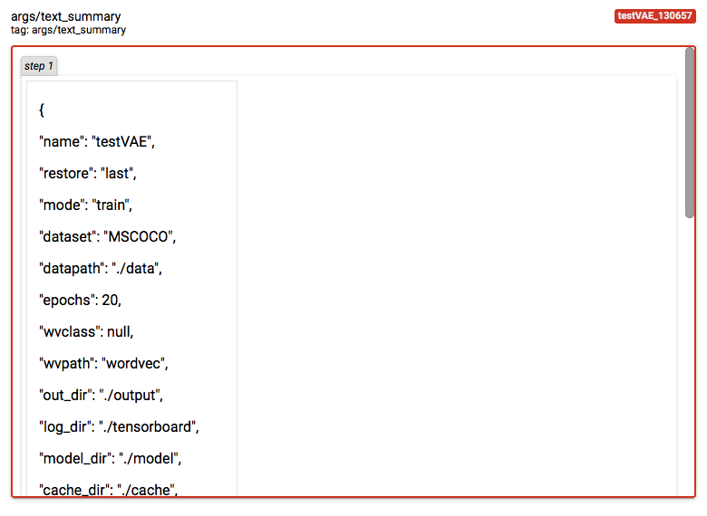

## VAE -- a tensorflow implementation


An implementation of VAE language generation model. Refer to the following paper for more details:

Bowman, S., Vilnis, L., Vinyals, O., Dai, A., Jozefowicz, R., and Bengio, S. Generating sentences from a continuous space. In *Proceedings of the Twentieth Conference on Computational Natural Language Learning*, 2016.


### Require Packages

- cotk
- TensorFlow == 1.3
- TensorBoardX >= 1.4


### Quick Start

- Downloading dataset and save it to ``./data``. (Dataset will be released soon.)
- Execute ``python run.py`` to train the model.
  - The default dataset is ``MSCOCO``. You can use ``--dataset`` to specify other ``dataloader`` class.
  - It use `gloves`  pretrained word vector by default setting. You can use ``--wvclass`` to specify ``wordvector`` class.
  - If you don't have GPUs, you can add `--cpu` for switching to CPU, but it may cost very long time.
- You can view training process by tensorboard, the log is at `./tensorboard`.
  - For example, ``tensorboard --logdir=./tensorboard``. (You have to install tensorboard first.)
- After training, execute  ``python run.py --mode test --restore best`` for test.
  - You can use ``--restore filename`` to specify checkpoints files, which are in ``./model``.
  - ``--restore last`` means last checkpoint, ``--restore best`` means best checkpoints on dev.
- Find results at ``./output``.


### Arguments

```
usage: run.py [-h] [--name NAME] [--restore RESTORE] [--mode MODE]
              [--dataset DATASET] [--datapath DATAPATH] [--epoch EPOCH]
              [--wvclass WVCLASS] [--wvpath WVPATH] [--out_dir OUT_DIR]
              [--log_dir LOG_DIR] [--model_dir MODEL_DIR]
              [--cache_dir CACHE_DIR] [--cpu] [--debug] [--cache]

A VAE language generation model

optional arguments:
  -h, --help            show this help message and exit
  --name NAME           The name of your model, used for variable scope and
                        tensorboard, etc. Default: runXXXXXX_XXXXXX
                        (initialized by current time)
  --restore RESTORE     Checkpoints name to load. "last" for last checkpoints,
                        "best" for best checkpoints on dev. Attention: "last"
                        and "best" wiil cause unexpected behaviour when run 2
                        models in the same dir at the same time. Default: None
                        (don't load anything)
  --mode MODE           "train" or "test". Default: train
  --dataset DATASET     Dataloader class. Default: MSCOCO
  --datapath DATAPATH   Directory for data set. Default: ./data
  --epoch EPOCH         Epoch for trainning. Default: 10
  --wvclass WVCLASS     Wordvector class, None for using Glove pretrained
                        wordvec. Default: None
  --wvpath WVPATH       Path for pretrained wordvector. Default: wordvec
  --out_dir OUT_DIR     Output directory for test output. Default: ./output
  --log_dir LOG_DIR     Log directory for tensorboard. Default: ./tensorboard
  --model_dir MODEL_DIR
                        Checkpoints directory for model. Default: ./model
  --cache_dir CACHE_DIR
                        Checkpoints directory for cache. Default: ./cache
  --cpu                 Use cpu.
  --debug               Enter debug mode (using ptvsd).
  --cache               Use cache for speeding up load data and wordvec. (It
                        may cause problems when you switch dataset.)
```

For hyperparameter settings, please refer to `run.py`.


#### For developer

- Arguments above (except ``cache``\\``debug``) are required. You should remain the same behavior (not for implementation).
- You can add more arguments if you want.


### An example of tensorboard

Execute ``tensorboard --logdir=./tensorboard``, you will see the plot in tensorboard pages:

Following plot are shown in this model:

- loss: reconstruction loss + kl loss.

  

- perplexity: reconstruction perplexity.

  

- kl_loss: kl_weight * min(kld, min_kl=10).

  

- kld: kl divergence.

  

- kl_weight: weight to the kl loss in the loss function.

  


And text output:



Following text are shown in this model:

- args


### An example of test output

Execute ``python run.py --mode test --restore last``

The following output will be in `./output/[name]_test.txt`:

```
perplexity:     7.292317
Fancy decorated bathroom with a toilet , sink , and shower .
A close-up of a plate with a sandwich in the middle .
Two giraffe stand together eating some leaves .
A street sign is displayed on the sidewalk .
A city street with cars and buses driving down it .
A painting with a clock tower in the middle of a city .
A man sitting at a table eating food .
A small airplane flying in the sky .
Two children in a field playing with a frisbee .
A train with graffiti on the side of it .
A woman walking in front of a bus .
A man is riding a wave with the ocean .
A television that is in the middle of a room .
Man in white shirt with tennis racket in hand .
The young girl is riding a horse through the water .
A man is holding the neck up as he holds his hands .
A glass vase filled with flowers in a room .
A man driving a motorcycle with a dog .
People are riding skis down a snowy slope .
A piece of cake is on a plate with a fork .
A persons hands holding up a cell phone in their hands .
A white and red plane is flying in the sky .
...
```

#### For developer

- You should remain similar output in this task.


### Performance

|        | Reconstruction Perplexity | KL divergence |
| ------ | ------------------------- | ------------- |
| MSCOCO | 7.29                      | 10.49         |


### Author

[Qi Zhu](https://github.com/zqwerty)